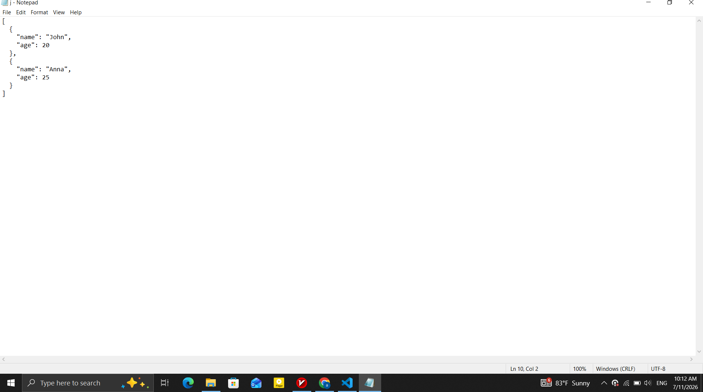
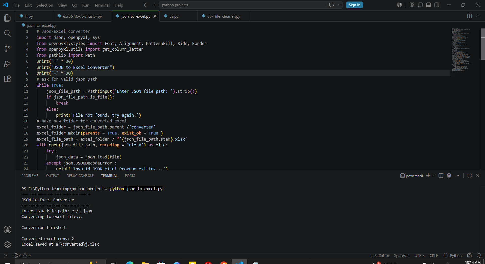
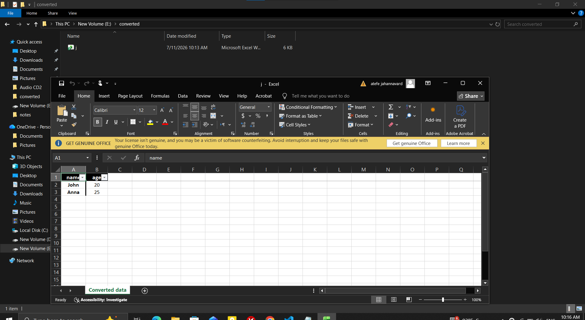

# 📄 JSON to Excel Converter


A Python CLI automation tool that converts structured JSON data into clean, formatted Excel workbooks.

The program validates JSON input, transforms lists of dictionaries into Excel worksheets, applies professional formatting, and saves the converted workbook to a dedicated output folder without modifying the original file.

---

## 🖥️ Pipeline Lifecycle & Live Demo

### Ingestion ➔ Processing ➔ Output

<p align="center">
  
  
</p>

<p align="center">
  
</p>

---
## 🧠 Core Features & Architecture

* 📄 **JSON to Excel Conversion:** Converts JSON files containing lists of dictionaries into Excel workbooks.
* ✅ **Input Validation:** Verifies that the JSON file is valid before processing and detects unsupported structures.
* 📋 **Schema Verification:** Ensures every record contains a consistent set of fields before generating the workbook.
* 🎨 **Workbook Formatting:** Applies professional header styling, alignment, borders, and formatting for improved readability.
* 📌 **Excel Enhancements:** Automatically freezes the header row, enables filters, and adjusts column widths.
* 📂 **Safe Output Management:** Preserves the original JSON file and saves the converted workbook in a dedicated output folder.

---

## 🛠️ Tech Stack & Requirements

* **Core Language:** Python 3.x
* **JSON Processing:** `json`
* **Spreadsheet Engine:** `openpyxl`
* **File Handling:** `pathlib`

---
## ⚡ Quick Start & Usage

### 1. Clone the repository

```bash
git clone https://github.com/DevBlueprintLab/python-json-to-excel-converter.git
cd python-json-to-excel-converter
```

### 2. Install dependencies

```bash
pip install openpyxl
```

### 3. Run the tool

```bash
python json_to_excel.py
```
### 4. Execution example

```text
==============================
Convert to Excel
==============================

Converting to Excel...

Conversion finished!

Converted Excel rows: 25

Saved:
employees.xlsx
```

---

## 📁 Project Structure

```text
python-json-to-excel-converter/
├── json_to_excel.py         # Main automation script
├── README.md                # Project documentation
└── images/
    ├── json-input.png
    ├── terminal-output.png
    └── excel-output.png
```

---
## 🔮 Roadmap & Future Improvements

* Support nested JSON objects
* Convert multiple JSON files in a single execution
* Allow custom worksheet names
* Automatically detect numeric and date columns
* Export to CSV as an additional output format
* Develop a graphical user interface (GUI)

---

Developed by **DevBlueprint Lab**
