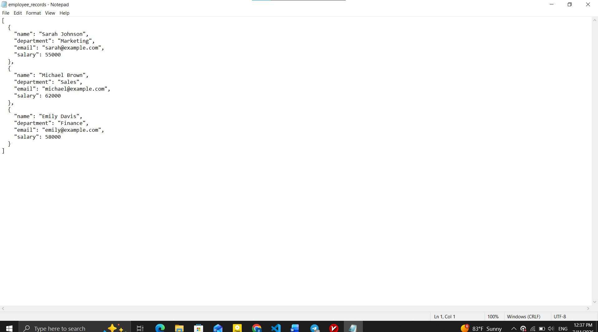
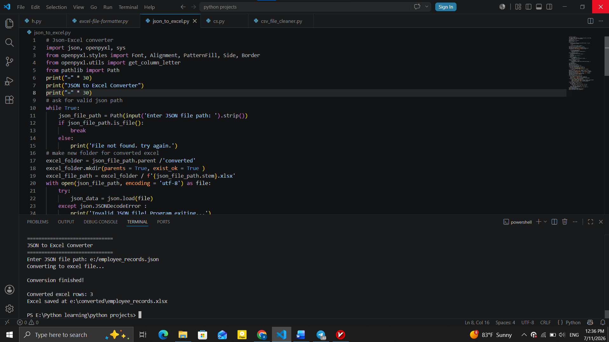
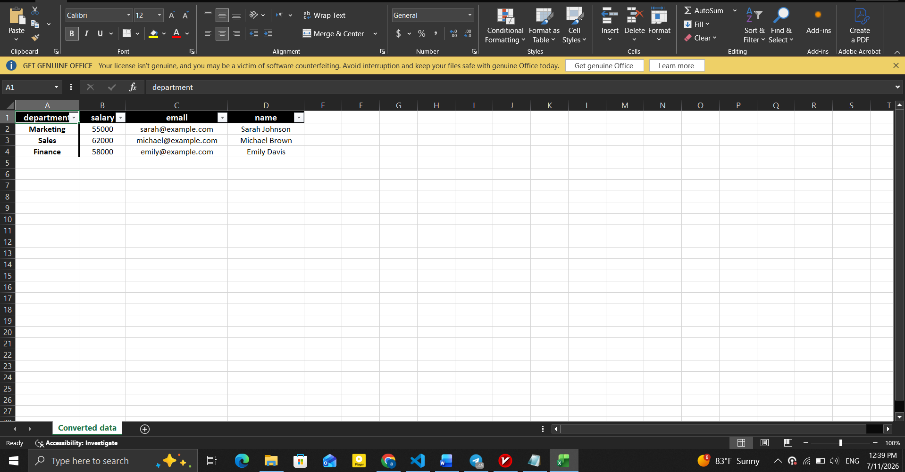

# 📄 JSON to Excel Converter


---
# 🖥️ Demo

### JSON Input ➜ Automated Conversion ➜ Excel Output

<p align="center">
  
  
</p>

<p align="center">
  
</p>


---

# 🎯 Problem

JSON is commonly used for storing and transferring structured data, but converting it into a readable Excel format often requires repetitive manual work.

Manually copying data, formatting spreadsheets, and organizing reports can be time-consuming and prone to errors.

---

# ✅ Solution

This tool automates the conversion workflow by:

- Validating JSON input before processing
- Transforming structured records into Excel worksheets
- Applying professional spreadsheet formatting
- Creating organized output files without modifying the original data

---

# ⚡ Core Features

- 📄 **JSON to Excel Conversion**  
  Converts JSON files containing structured records into Excel workbooks.

- ✅ **Input Validation**  
  Checks that the JSON file contains valid data structures before conversion.

- 🔍 **Consistent Data Checking**  
  Ensures records contain matching fields before creating the spreadsheet.

- 🎨 **Excel Formatting Automation**  
  Applies header styling, alignment, borders, filters, and freeze panes for improved readability.

- 📐 **Automatic Column Sizing**  
  Adjusts worksheet column widths based on content length.

- 📂 **Safe Output Handling**  
  Keeps the original JSON file unchanged and saves converted workbooks into a dedicated output folder.

---
# 🛠️ Tech Stack

- **Language:** Python 3.x
- **Excel Processing:** `openpyxl`
- **JSON Processing:** Built-in `json` module
- **File Handling:** `pathlib`


---

# 🚀 Quick Start

## 1. Clone the repository

```bash
git clone https://github.com/DevBlueprintLab/python-json-to-excel-converter.git

cd python-json-to-excel-converter
```

## 2. Install dependencies
Install the required Python packages:

```bash
pip install -r requirements.txt
```
## 3. Run the converter

```bash
python json_to_excel.py
```

## 4. Provide your JSON file path

Example:

```text
==============================
JSON to Excel Converter
==============================

Enter JSON file path:
```

The converted Excel workbook will automatically be created inside:

```text
converted/
```

Example:

```text
converted/
└── employees.xlsx
```

---

# 📁 Project Structure

```text
python-json-to-excel-converter/

├── json_to_excel.py        # Main automation script
├── README.md
├── LICENSE
├── requirements.txt        # Project dependencies
├── sample_data/            
│   └── example.json        # Example input file
└── images/
    ├── json-input.png
    ├── conversion-process.png
    └── excel-output.png
```
---

# 💼 Practical Use Cases

This automation tool can help with:

- Converting exported JSON data into Excel reports
- Preparing structured data for spreadsheet analysis
- Transforming machine-readable files into user-friendly formats
- Automating repetitive data conversion workflows

---

# 🔮 Future Improvements

- Support nested JSON objects
- Process multiple JSON files in one execution
- Allow custom worksheet names
- Add additional export formats such as CSV

---

# 📜 License

This project is licensed under the MIT License.

---

Developed by **DevBlueprintLab**
